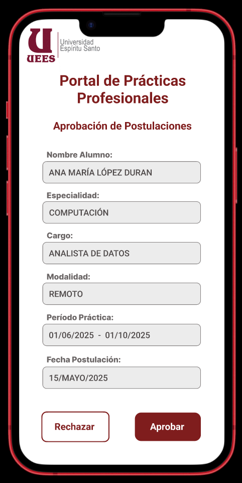

## 📄 Pantalla de Aprobar Postulación

**Elementos claves:**

- Logo de la institución.  
- Nombre completo del alumno
- Especialidad 
- Cargo 
- Modalidad 
- Período de práctica
- Fecha de postulación
- Botón “Rechazar”
- Botón “Aprobar”

---

[🔗 Ver prototipo interactivo en Figma](https://www.figma.com/proto/j0V39vu9UWRNKr74xZncYf/Portal-de-Pr%C3%A1cticas---Estudiante?node-id=269-197&p=f&t=PVVBG24DJhpVA5Ky-1&scaling=scale-down&content-scaling=fixed&page-id=269%3A196)

---

