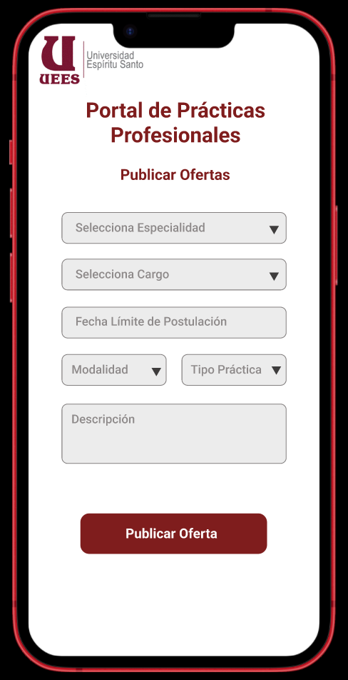

## 📄 Pantalla de Publicar Ofertas

**Elementos claves:**

- Logo de la institución.  
- Lista de Especialidad
- Lista de cargos por especialidad
- Fecha límite de postulación
- Lista de modalidad
- Lista de tipo de práctica
- Descripción de la oferta.
- Botón “Publicar Oferta”

---

[🔗 Ver prototipo interactivo en Figma](https://www.figma.com/proto/j0V39vu9UWRNKr74xZncYf/Portal-de-Pr%C3%A1cticas---Estudiante?node-id=163-14&p=f&t=Cu8fbiEcHuFPWl8N-0&scaling=scale-down&content-scaling=fixed&page-id=131%3A252)

