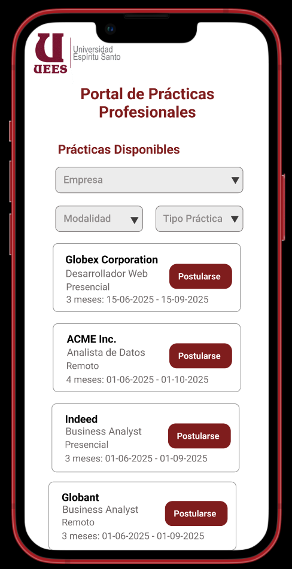

# ?? Pantalla de Resultados de Prácticas Disponibles

**Elementos claves:**

- Logo de la institución.  
- Lista de ofertas con tarjetas/resumen:
	- Empresa
	- Cargo/rol
	- Modalidad (remoto, presencial, híbrido)
	- Duración / fechas
	- Botón “Postularse”
- Filtros: Empresa, modalidad, tipo práctica

---

[?? Ver prototipo interactivo en Figma](https://www.figma.com/proto/j0V39vu9UWRNKr74xZncYf/Portal-de-Pr%C3%A1cticas---Estudiante?node-id=48-85&p=f&t=KmIV1nl8xFDg1VZD-1&scaling=scale-down&content-scaling=fixed&page-id=1%3A3&starting-point-node-id=48%3A85)

