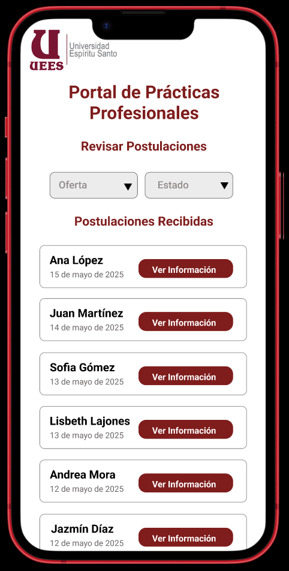

## ?? Pantalla de Revisar Publicaciones

**Elementos claves:**

- Logo de la institución.  
- Nombre alumno
- Fecha de postulación
- Botón “Ver Información”
- Filtros: Oferta, estado

---

[?? Ver prototipo interactivo en Figma](https://www.figma.com/proto/j0V39vu9UWRNKr74xZncYf/Portal-de-Pr%C3%A1cticas---Estudiante?node-id=269-72&p=f&t=rkyM82MYxftutv1B-1&scaling=scale-down&content-scaling=fixed&page-id=269%3A70)

