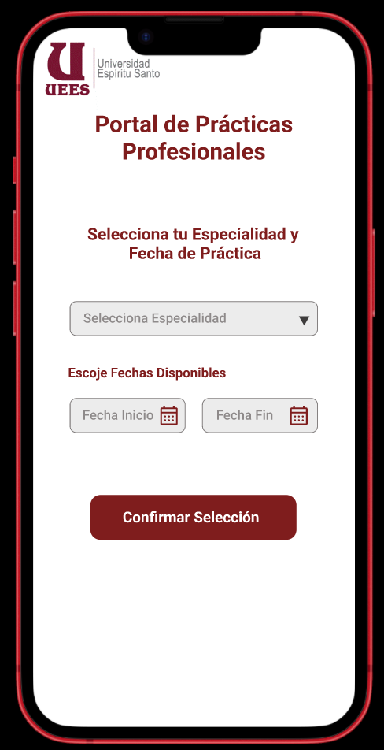

#?? Pantalla de Selección Especialidad

**Elementos clave:**

- Logo de la institución.  
- Menú desplegable: Especialidad o carrera
- Calendario: Rango de fechas disponible para prácticas
- Botón: “Confirmar Selección” 

---

[?? Ver prototipo interactivo en Figma](https://www.figma.com/proto/j0V39vu9UWRNKr74xZncYf/Portal-de-Pr%C3%A1cticas---Estudiante?node-id=11-4&p=f&t=LX86wjhfLi2ON9ur-1&scaling=scale-down&content-scaling=fixed&page-id=1%3A2)

