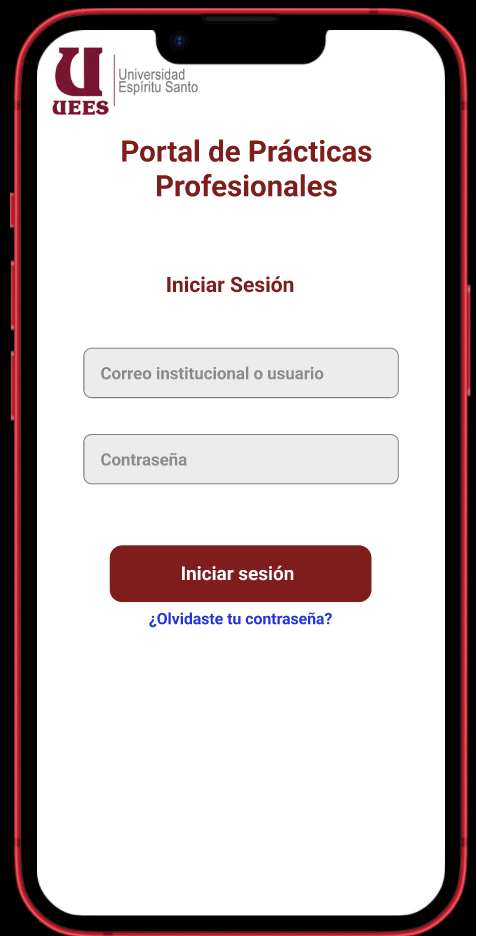

## 🔐 Pantalla de Autenticación

**Elementos claves:**

- Logo de la universidad o plataforma (parte superior).  
- Selector desplegable de tipo de usuario (por defecto "Estudiante").  
- Campos:
  - Email o usuario.  
  - Contraseña.  
- Botón: Iniciar sesión.  
- Enlace: “¿Olvidaste tu contraseña?” 

[🔗 Ver prototipo interactivo en Figma](https://www.figma.com/proto/j0V39vu9UWRNKr74xZncYf/Portal-de-Pr%C3%A1cticas---Estudiante?node-id=2-4&p=f&t=OjueuoohjoiThoo2-1&scaling=scale-down&content-scaling=fixed&page-id=0%3A1)

